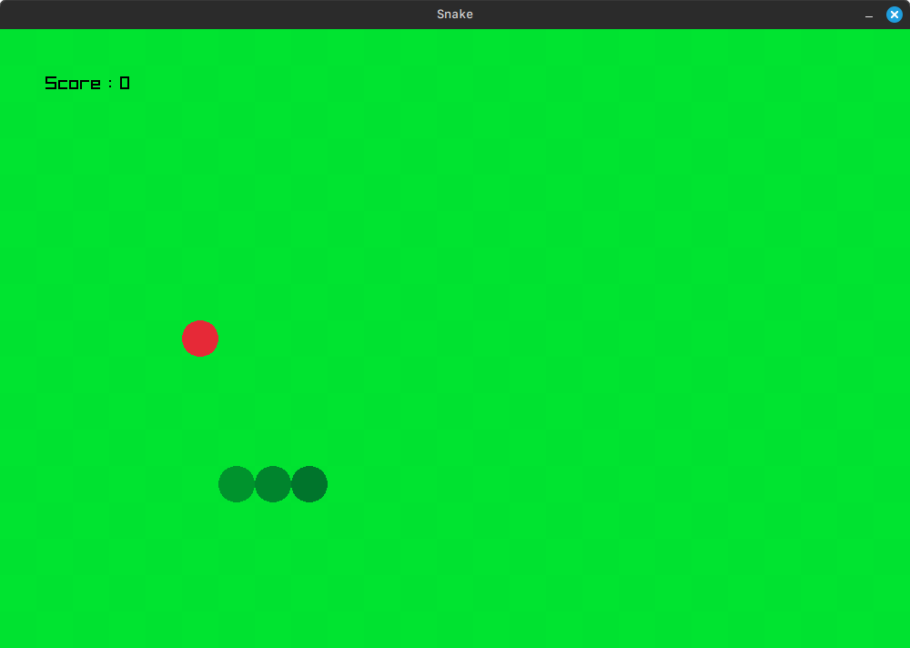

# Snake Game

## Description
This project is a simple snake game implemented in C++ using the [raylib](https://www.raylib.com).

## Preview


## Installation
1. Clone the repository:
    ```sh
    git clone --recurse-submodules -j8 https://github.com/Toudonou/snake-game.git
    ```
2. Navigate to the project directory:
    ```sh
    cd snake-game
    ```
3. Build the project using `cmake`:
    ```sh
    mkdir build && cd build
    ```
   ```sh
    cmake ..
    ```
   ```sh
    cmake --build 
    ```
   ```sh
    ./snake
    ```

## How to play
Use the arrow keys to move the snake. 
  - `Up`: Moves snake's head upwards
  - `Down`: Moves snake's head upwards
  - `Left`: Moves snake's head upwards
  - `Right`: Moves snake's head upwards

## Author
- [Toudonou](https://github.com/Toudonou)

## Useful Links
- [Assets](https://opengameart.org/content/snake-game-assets)


## License
This project is open source, under the MIT License [see](LICENSE).